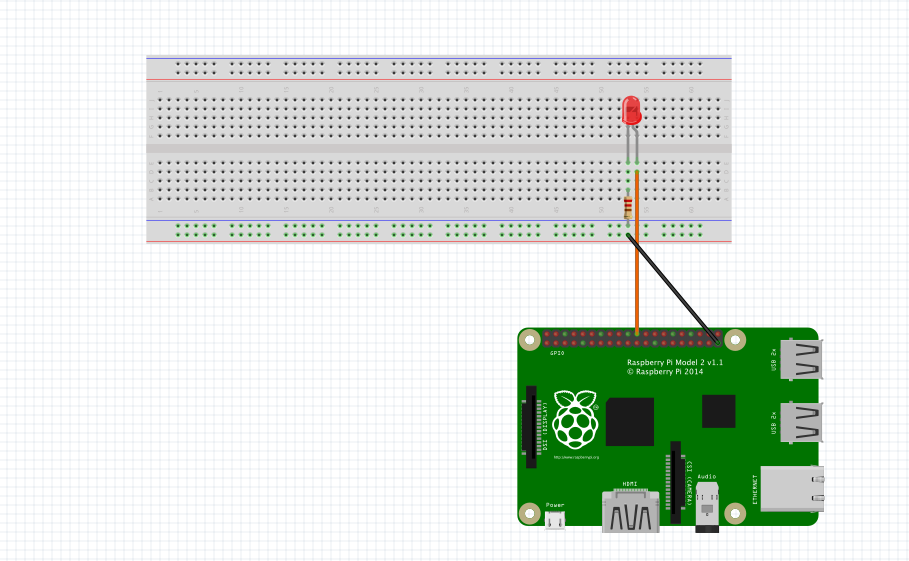

# RPi-nodejs
## I use python-shell
### using nodejs call Python for GPIO on RPi
#### How to run
> $ npm install


> $ node localhost:3000

***
### Example Program
```
PythonShell.run('YourPythonCode.py', function (err) {
  if (err) throw err;
  console.log('finished');
});
console.log("test");
```


### Pin 22 (GPIO 25)
### Pin 39 (GND)


